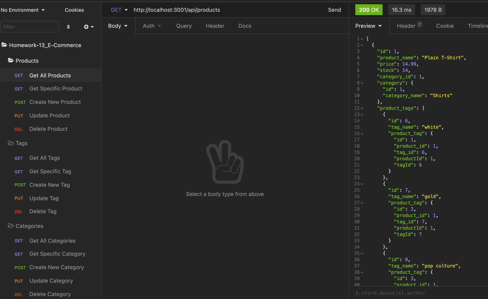

# ORM E-Commerce Backend
  [](https://opensource.org/licenses/MIT)

  ## Description

  This e-commerce backend system uses Node, Express, and Sequelize ORM to connect to and interact with a MySQL database. The database itself is made up of four tables, Product, Category, Tag, and ProductTag, each of which are modeled using sequelize and interacted with using our Express api routes.

  ## Table of Contents

  * [Installation](#installation)
  * [Usage](#usage)
  * [Video](#video)
  * [Screenshots](#screenshots)
  * [License](#license)
  * [Contribute](#contribute)
  * [Tests](#tests)
  * [Questions](#questions)
 
  ## Installation

  To install necessary dependencies, run the following command:

  ```
  npm i
  ```

  This app comes with a .env file which you should edit to reflect your personal/local database credentials and save. Then, to recreate the sample database on your local instance of mysql, run ./db/schema.sql which will create the necessary ecommerce_db in mysql for you. Finally, to seed the database with sample data, run:

  ```
  node seeds/index.js
  ```

  To start the application, run:

  ```
  node server
  ```

  Then test away using insomnia or postman.


  ## Usage

  This is a student repo.


  ## Video

  Please click on the following links (please note: there are two parts) to see a walkthrough video of this application's functionality:

  1. [Screentastify Video Part One](https://drive.google.com/file/d/10dUPOITFAlT7zgaCsDfGjYbDMO52WiZr/view)
  2. [Screentastify Video Part Two](https://drive.google.com/file/d/1O7sP_OIsrtfB5H-Pucp2YCf9EbLcq_TU/view)


  ## Screenshots

  


  ## License

  [](https://opensource.org/licenses/MIT) This project is licensed under the [MIT](https://opensource.org/licenses/MIT) license.


  ## Contribute

  Contributions are always welcome! (Please fork and pull request only.)


  ## Tests

  To run tests, run the following command: 

  ```
  npm test
  ```

  ## Questions

  If you have any questions about the repo, open an issue or contact me directly at susan.fujii@me.com. You can find more of my work at [srfujii](https://github.com/srfujii/).

